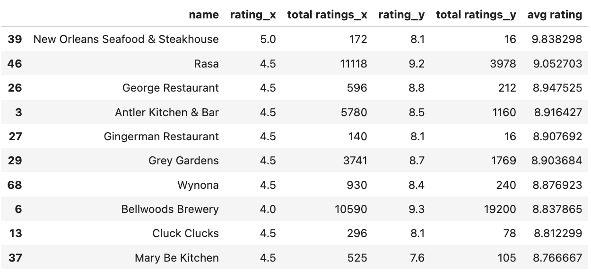
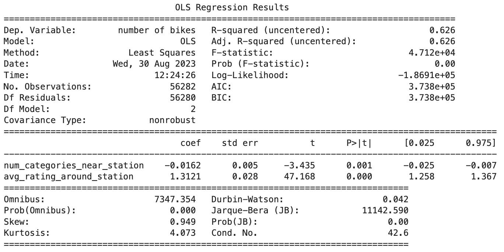
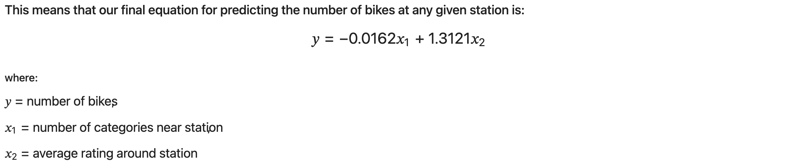

# Final-Project-Statistical-Modelling-with-Python

## Project/Goals
I'd like to successfully build a linear regression model for the number of bikes at a given bike station in Toronto based off the information I can find for all the POIs within a 1 km radius of the bike station.  

## Process
#### - Successfully call, and parse through the various APIs required to complete this project
#### - Create a CitiBikes, Foursquare, and Yelp DataFrames from the API results.
#### - Merge these DataFrames together into one
#### - Perform EDA on the data, deal with erroneous or missing data, find connections between the variables
#### - Create a linear regression model and be able to analyze the results of model

## Results
### Comparing APIs:
- Both the Yelp and Foursquare APIs returned similar information, although this information is laid out slightly different in their JSON returns.  I did find that the Yelp API was better at filtering results based on category, but it did have some attributes that were only available if you are a paid member.  This was not an issue since I didn't end up using these POI attributes. 
- What was quite satisfying to me was that when I finally determined the list of the top 10 restuarants, there was one on the list that I have been to multiple times because of how much I enjoyed it.  I was glad to see it made the list, because I would have put it there myself ;)

### Joining the Data and EDA:
- I ended up joining the data "horiztonally" because I figured that there must be some overlap between the POIs returned from Foursquare and Yelp for a single bike station.  So I wanted to make sure that I had all of the information for each POI per station to have all it's information in one row.  Unfortunately, there were not as many overlaps as I had expected.  In fact, there might have only been 4000 matched returns between Foursquare and Yelp.  That was a surprise to me since I had removed all categorical filters from the FS and Yelp API calls.  
- Due to this lack of overlap, I ended up with alot of missing values to deal with in the joined dataframe.  All of the numerical ones were dealt with in a way that made sense to me. Since I pretty well grabbed the same information from both FS and Yelp, most of these missing values were just filled in with the matching value from the other API.  For any values that didn't have a "matching" column, I filled in the missing values with the average of that column.  Any non-numeric columns were left alone since the regression model wouldn't be using these anyways.
- I decided to engineer some values of my own because I felt like if we were going to be making and meangingful connections between the number of bikes at a station and the attributes of the POIs around that station, we were lacking some station-specific values.  I had plenty of values specific to each POI, where many of these POIs were also listed for other stations, but I wanted to use this information to create some station-centric values - such as the average rating of all POIs around the station and the total number of categories around the station.  I expected these to be better predictors when building my model.
- I created a number of visualizations that gave me some insight into how my data was distributed and how my variables were correlated, if at all.  These visualizations ended up being a "verification" or "indication" of the results I would see when building my model.

### Model Building
- With all numerical values included in my first attempt to build a regression, I could get a sense of what my "worst case scenario" might look like.  It wasn't looking good with an adj R-sqaured of 0.09.
- After checking for multicollinearity, which there was plenty, and removing the offenders, my R-sqaured actually seemed to get even worse.  However, I could not justify keeping these multicollinear variables.
- I then ran a backwards elimination loop that would run the regression model, remove the variable with the largest P-value, then run again until all P-values were less than 0.05.  This improved my Adj. R-squared to around 0.627
- Next, I analyzed the coefficients of the remaining variables to get an idea of how impactful they were to the model.  This was a little tough to see, so I normalized the data and then checked the coefficients again.
- I eliminated the variables that had very low coefficients, but also the variables that "didn't make sense" for the model or had distributions that were not normal.
- Once I was complete, the only variables I had left were the engineered variables.
- My final R-squared value was 0.626 --> This was a little less than the last, but I felt better about the variables that had been included in the model.

- This was my final equation:

## Challenges 
- Yelp category names were not as useful as foursquare category names.  For example, restaurants could have a wide variety of categorical names like "comfort food" or "Indian".  So many of these POIs that were in fact restaurants did not included the word "restaurant" in their category names.  This made the search for the Top 10 Restaurants more challenging. 
- Connecting the Foursquare and Yelp dataframes horizontally proved to be more difficult than just joining on "POI name" and "station_id".  This is because a single station coordinates could have returned multiple POIs with the same name (like Starbucks, Tim Hortons, etc).  So when I tried to join on only name and station_id, I was getting some of these Fourquare POIs attached to the wrong Yelp POI, even though they had the same name and station.  To address this, I had to also join on longitude and latitude of the POIs (which was also a challenge in and of itself since the coordiantes were slightly different between the same POI returned from both FS and yelp).
- When building the model I found it a challenge to know when to keep or eliminate an independent variable - especially when they made my R-squared "better"
- Knowing when to stop working on the project.  With it being so open ended, the possibilities to satisfy my own curiosity are endless.  So it's hard to determine when I need to wrap it up.  (SORRY TO THE PERSON WHO HAS TO MARK MY PROJECT! :P)

## Future Goals
- I would engineer some more station-centric variables to try and build a better model.
- I would like to get WAY MORE different snapshots of the bike stations to really get a sense of the activity at each station and how that relates to the POIs around it.  I feel like with just one snapshot of the stations, depending on when you made your API, you might have a different number of bikes available, and therefore, a different model.
